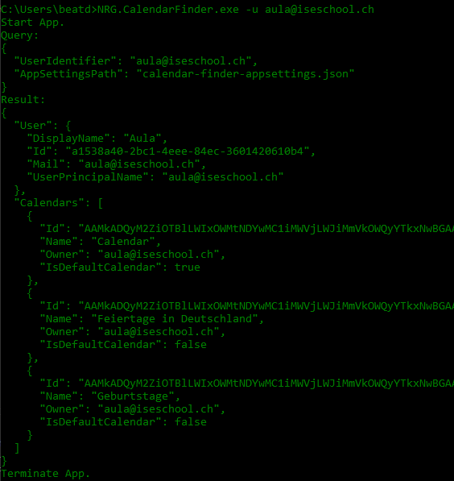

# calendar-finder
The `CalendarFinder` is an app to find all calendars of a user and some user-data in an easy way without making any `http` requests in ms-graph.

## Usage
In the example below, the calendars for the `UserPrincipalName` 'aula@iseschool.ch are found.
### Query
In this section, the parameters the exe is calles with are listed.
### Result
In this section, the found values are listed.
### Example

## Needs
- [Appregistration (Azure Ad App)](https://learn.microsoft.com/en-us/entra/identity-platform/quickstart-register-app)
- Necessary Permissions on the App (Azure Ad App)

## Used Libraries
- [Command Line Parser](https://github.com/commandlineparser/commandline)
- [Ms Graph](https://github.com/microsoftgraph/msgraph-sdk-dotnet)
- [Azure Identity](https://github.com/Azure/azure-sdk-for-net)
- [Microsoft.Extensions.Hosting](https://github.com/dotnet/runtime)